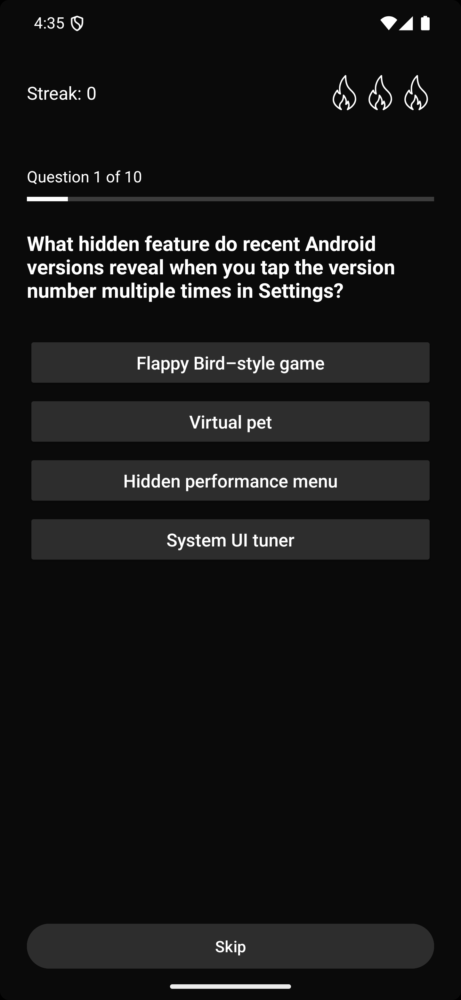
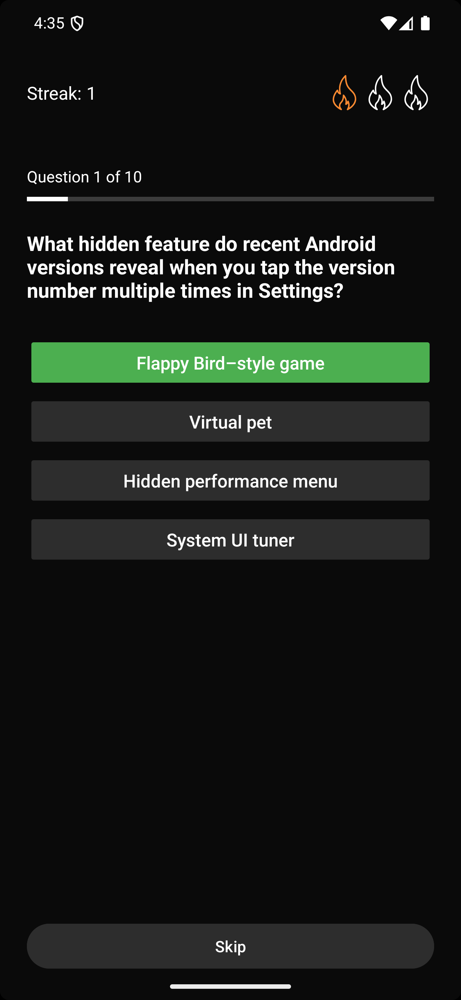
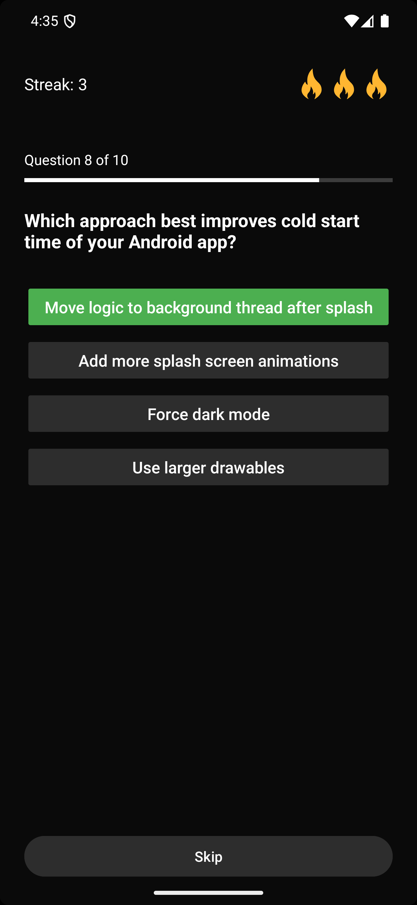
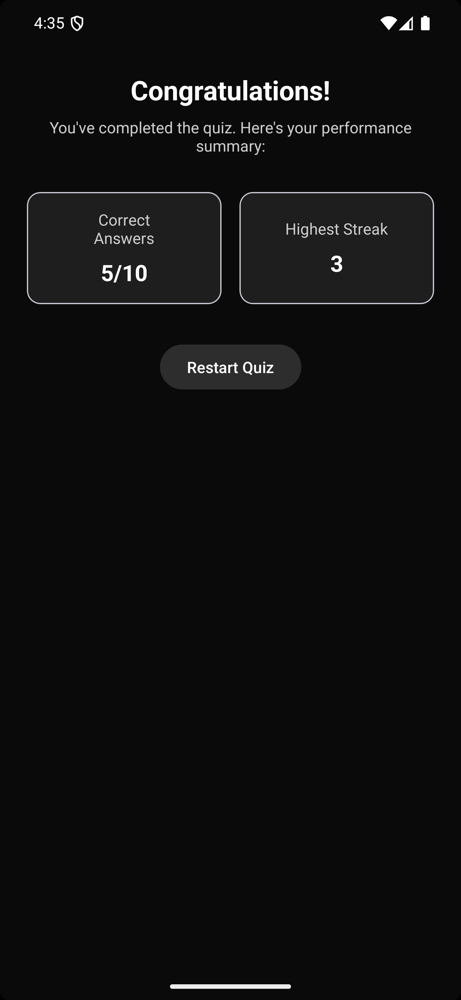

# QuizApp

A modern Android quiz application built with Kotlin that provides an engaging quiz experience with streak tracking and comprehensive score analysis.

## 📱 Tech Stack

- **Language**: Kotlin
- **UI**: XML layouts
- **Architecture**: MVVM (Model-View-ViewModel)
- **Concurrency**: Coroutines for asynchronous operations
- **Dependency Injection**: Hilt
- **Navigation**: ViewPager2 for question navigation

## 🖥️ Screens

### 1. Splash Screen


- Initial loading screen
- Parses JSON data containing quiz questions
- Prepares data for the main quiz flow

### 2. Questions Activity


- Main quiz container activity
- Manages ViewPager2 for question navigation
- Handles quiz flow coordination

### 3. Questions Fragment



- Individual question display fragment
- Integrated with ViewPager2 for smooth question transitions
- Handles user answer selection

### 4. Streak Fragment


- Real-time streak tracking display
- Shows current streak progress
- Updates dynamically as user progresses

### 5. Scoreboard Activity


- Final results screen
- Displays correct answers
- Shows highest streak achieved
- Provides restart functionality to begin quiz from question 1

## 🏗️ Implementation Details

### Data Flow
1. **Splash Screen**: Parses JSON data containing quiz questions and initializes the app
2. **Questions Activity**: Receives parsed data and sets up ViewPager2 with question fragments
3. **Questions Fragment**: Displays individual questions using a custom adapter for ViewPager2
4. **Streak Tracking**: Real-time streak updates through dedicated fragment
5. **Results**: Scoreboard activity launches after quiz completion with comprehensive results

### Architecture Components
- **Shared ViewModel**: Manages data sharing between fragments and activities
- **MVVM Pattern**: Ensures clean separation of concerns and maintainable code structure

### Key Features
- **Asynchronous Processing**: Coroutines handle background tasks and data operations
- **Dependency Injection**: Hilt provides clean dependency management
- **Clean Architecture**: MVVM pattern ensures scalable and testable code
- **Smooth Navigation**: ViewPager2 enables fluid question-to-question transitions
- **State Management**: Shared ViewModels maintain consistent app state

## 🚀 Getting Started

### Prerequisites
- Android Studio Arctic Fox or later
- Kotlin 1.5+
- Android SDK 21+

### Installation
1. Clone the repository
```bash
git clone https://github.com/yourusername/QuizApp.git
```

2. Open the project in Android Studio

3. Sync the project with Gradle files

4. Run the app on an emulator or physical device

## 🎯 Usage

1. **Launch**: App starts with splash screen loading quiz data
2. **Quiz Flow**: Navigate through questions using swipe gestures
3. **Streak Tracking**: Monitor your current streak in real-time
4. **Results**: View comprehensive results and restart the quiz

## 📊 Features

- ✅ JSON-based question loading
- ✅ Smooth question navigation with ViewPager2
- ✅ Real-time streak tracking
- ✅ Comprehensive scoreboard with correct answers
- ✅ Restart functionality
- ✅ Clean MVVM architecture
- ✅ Dependency injection with Hilt
- ✅ Coroutines for background processing

## 🤝 Contributing

1. Fork the repository
2. Create your feature branch (`git checkout -b feature/AmazingFeature`)
3. Commit your changes (`git commit -m 'Add some AmazingFeature'`)
4. Push to the branch (`git push origin feature/AmazingFeature`)
5. Open a Pull Request

## 📝 License

This project is licensed under the MIT License - see the [LICENSE](LICENSE) file for details.
